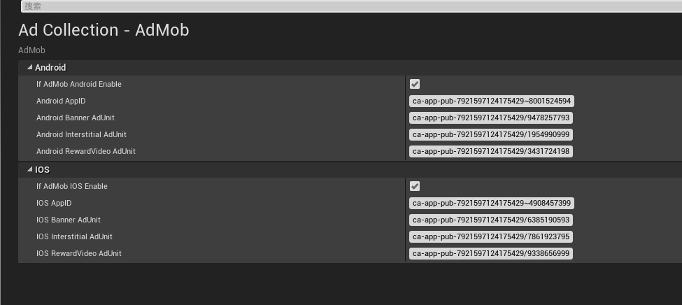
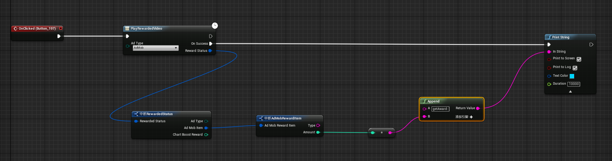

# UnrealEngine4-Admob
One line code(or blueprint) Integrates Google AdMob mediation system with other ad networks for iOS &amp; Android.

This Plugin help you easy integrates multiple ad networks for your game both Android and IOS same code, 
You can dynamic configure and manager multiple ads by google Admob, it will  help you maximize fill rate and increase monetization.
All features are available in C++ and Blueprint. this plugin automatic process ads reload and other detail, so
 you can easy use just call when you need.

# FEATURES: 
★ 5 best game ad networks supported.

★  extremely easy  integrates just one line c++ code or blueprint for both IOS and Android. plugin automatic process ads reload
  and other detail.

★  supoort unreal engine 4 4.15,4.16 and 4.17.

★ support via e-mail feixuwu@outlook.com

# PLATFORM SUPPORTED:
★ Android

★ IOS

# AD TYPES:
★ Banner

★ Interstitial (text, picture, video)

★ Reward Video

# SUPPORTED AD NETWORKS(more comming soon): 
★ AdMob

★ Vungle

★ ChartBoost

★ Unity

★ AdColony

# Install

Watch this video to learn how to use the plugin

1、Please first confirm you installed Visual Studio 2015 or 2017, and installed c++ compile support.

2、If your project is a pure blueprint project, please add an empty c++ class to the project, or else the plugin may not be compiled.

3、Copy Plugins folder to your project root folder, double click to open your game project as usual, the engine will 
 notify you to compile the plugin, confirm to compile the plugin, wait several minutes(3-5), the editor will lauched. If there is  any problem(UBT is complicate, and some bugs), please contact me let me help you to fix it.

# Usage
  you can simply run the demo project for test, to integrates your own project, juse few steps:
  
1、Copy Plugins folder to your project and compile the editor.

2、Configure Ads? easy!!
      open project editor and find Admob Setting,  fill your application id for both Android and IOS.
      
      
3、In blueprint Editor, when you want show show the ads, just call function "PlayRewardedVideo",  setting the ad platform Admob(we only need Admob, other ads can confiure from Admob,
	by adding ad source) . 
       you can add custom event to process after user complete watched the ads video.
	

	  
# Other ShowCase
★ Want show Banner?
	

★ Want show interstitial?
	
	 
★ Want reward player with confiure coins?  
	
	
	
	
# Support
  
  Email:feixuwu@outlook.com
  
  TeamViewer remote support, you can first contact with emal
  
# License
 You can use this plugin for free during trial purpose. If it earns less than $1000 for you, you can continue to use for free.

If you have monetized more than $1000 using this plugin, you are also required to: either get a commercial license ($20), or, no need pay but share 2% Ad traffic, read the [License Agreement](docs/License-Agreement.md) for details. As a commercial customer, you will be supported with high priority.

# FAQ

## ★ I'm not good with C++, can I use this plugin?

  Yes, of course you can, use this plugin, you don't have to have C++ knowlege, and don't need recompile the all engine. 
  
  But you need to have visualstudio or xcode can build C++ code, just put the plugins folder under you project root folder,  
  then double click the uproject file as usual, after several minutes(3-5), the editor will launch.
  
  
## ★ Why I can't see my ads?
  After create admob or add new ad source, It'll wait some time(mybe several hours) the client can receive ads.
  
## ★ What's the difference with UnrealEngine4-EZ-Mobile-Ads?
  First, I created UnrealEngine4-EZ-Mobile-Ads for my self and sevral friends, it easy to use and manager multiple ads by client, but to add or remove new ads, you need resubmit you game, it's not flexible. However google admob mediation system support thirdparty ads and deliver ads with realtime eCPM from top to low. obviously, this is the better solution. 
