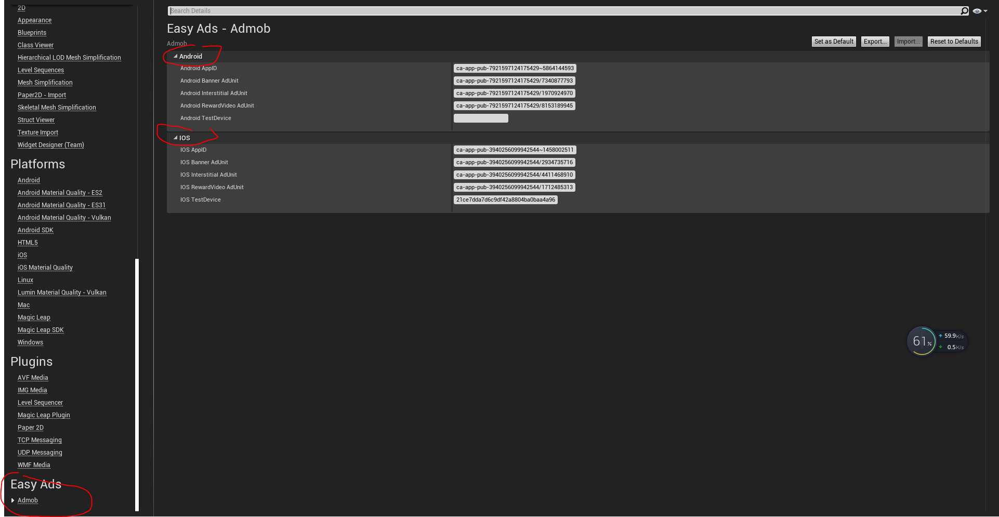
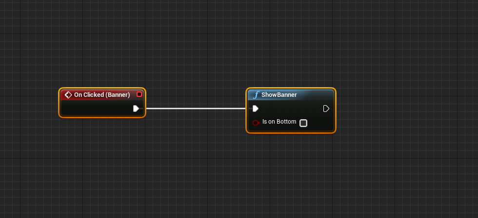
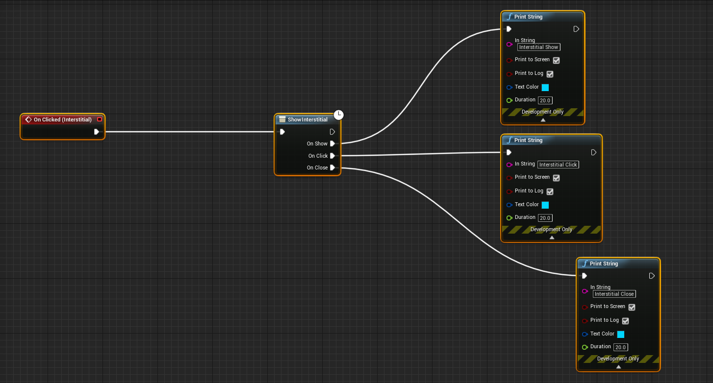
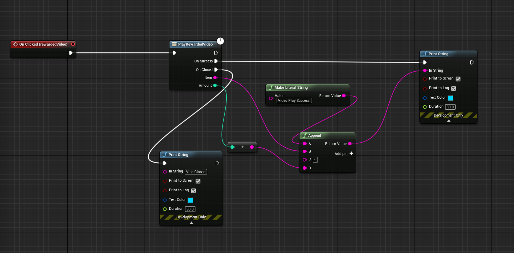
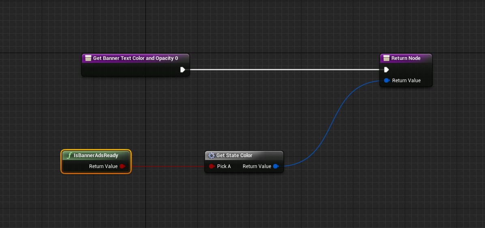
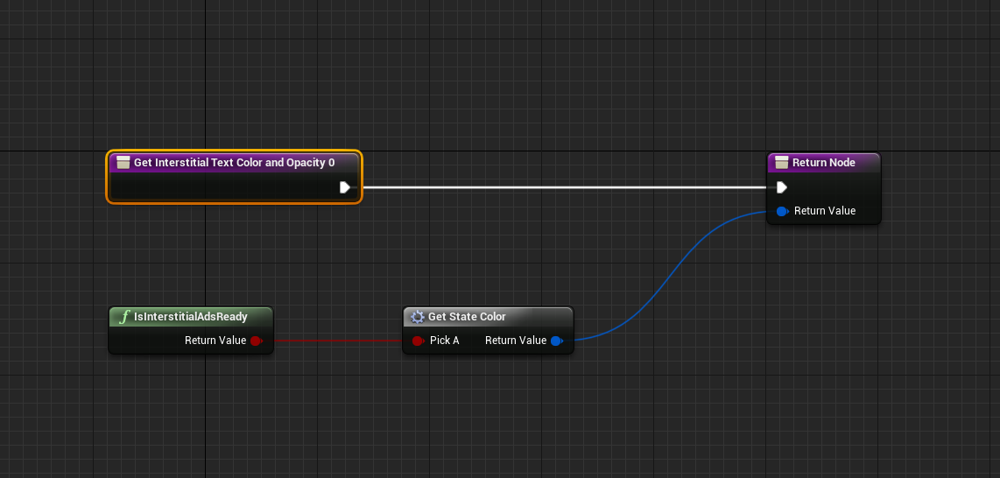
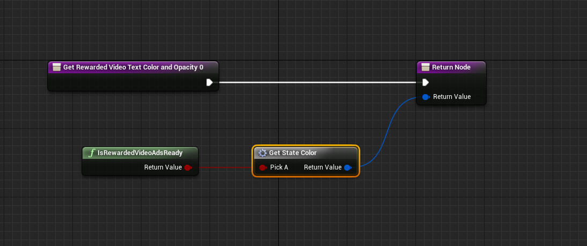
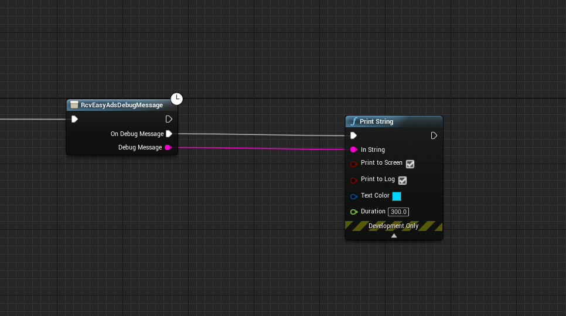

# UE4EasyAds
One line code(or blueprint) Integrates Google AdMob mediation system with other ad networks for iOS &amp; Android.

This Plugin help you easy integrates multiple ad networks for your game both Android and IOS same code, 
You can dynamic configure and manager multiple ads by google Admob, it will  help you maximize fill rate and increase monetization.
All features are available in C++ and Blueprint. this plugin automatic process ads reload and other detail, so
 you can easy use just call when you need.

# REMARK
  the plugin is on market now!!, the git content will be newer than the market.
   basic: https://www.unrealengine.com/marketplace/en-US/slug/ada7fb755f4541a685b497b6de0d0163
   
   pro version:https://unrealengine.com/marketplace/en-US/product/easyads-pro/
   
  all the content will first update here and then submit to marketplace.

# FEATURES: 
★ 4 best game ad networks supported.

★  extremely easy  integrates just one line c++ code or blueprint for both IOS and Android. plugin automatic process ads reload
  and other detail.

★  supoort unreal engine 4 4.23,4.24.

★ support via e-mail feixuwu@outlook.com

# PLATFORM SUPPORTED:
★ Android

★ IOS

# AD TYPES:
★ Banner

★ Interstitial (text, picture, video)

★ Reward Video

# SUPPORTED AD NETWORKS(more comming soon): 
★ AdMob

★ Vungle

★ ChartBoost

★ Unity

# Install

Watch this video to learn how to use the plugin

1、Please first confirm you installed Visual Studio 2015 or 2017, and installed c++ compile support.

2、If your project is a pure blueprint project, please add an empty c++ class to the project, or else the plugin may not be compiled.

3、Copy Plugins folder to your project root folder, double click to open your game project as usual, the engine will 
 notify you to compile the plugin, confirm to compile the plugin, wait several minutes(3-5), the editor will lauched. If there is  any problem(UBT is complicate, and some bugs), please contact me let me help you to fix it.

# Usage
 ## 1. fill ad unit
   open Editor->Project Setting, find EasyAds fill the ad unit:
 
  
  
  
 ## 2. call function show ads
 in blueprint editor, when you want show show the ads, just call function "ShowBanner", "ShowInterstitial", "PlayRewardedVideo"
  ShowBanner:
  
  
  
  ShowInterstitial:
  
  
  
  PlayRewardedVideo:
  
  
  
 Some times, you want to check if ads aviable, you can call "IsBannerReady", "IsInterstiralAdsReady", "IsRewardedVideoAdsReady"
  
  IsBannerReady:
  
  
  
  IsInterstiralAdsReady:
  
   
   
  IsRewardedVideoAdsReady:
  
   
   
  Read debug message to learn why ads load fail
  
   
   
 # License
   free to use, and I will share 2% ads traffic. If your game earn a lot of money from ads, you may want buy the pro version, it will not share any ads traffic.
	
	
# Support
  
  Email:feixuwu@outlook.com
  
  TeamViewer remote support, you can first contact with emal

